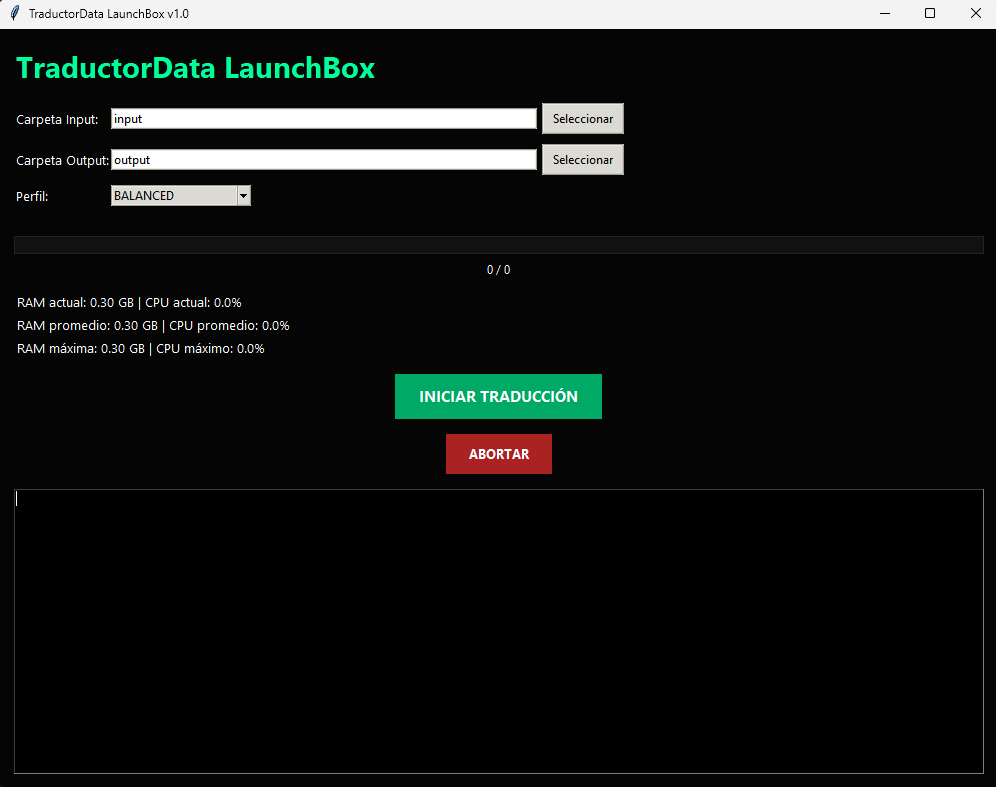
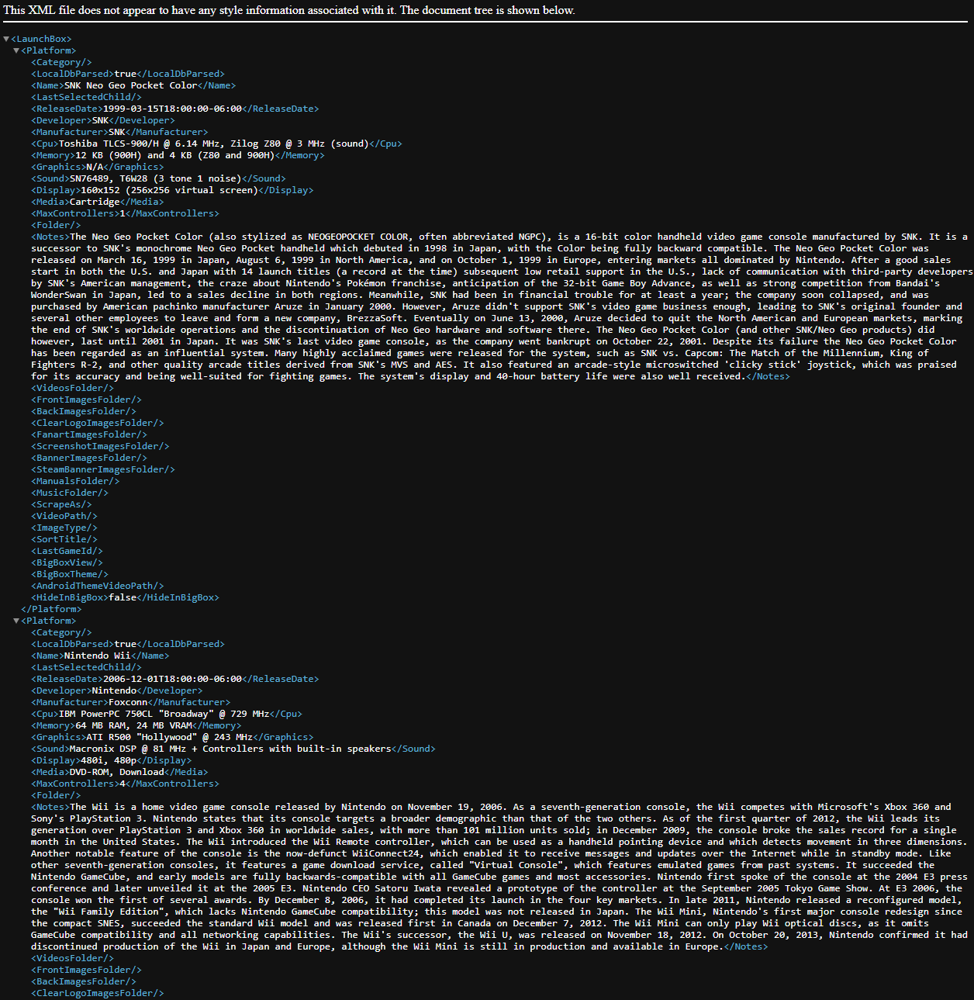
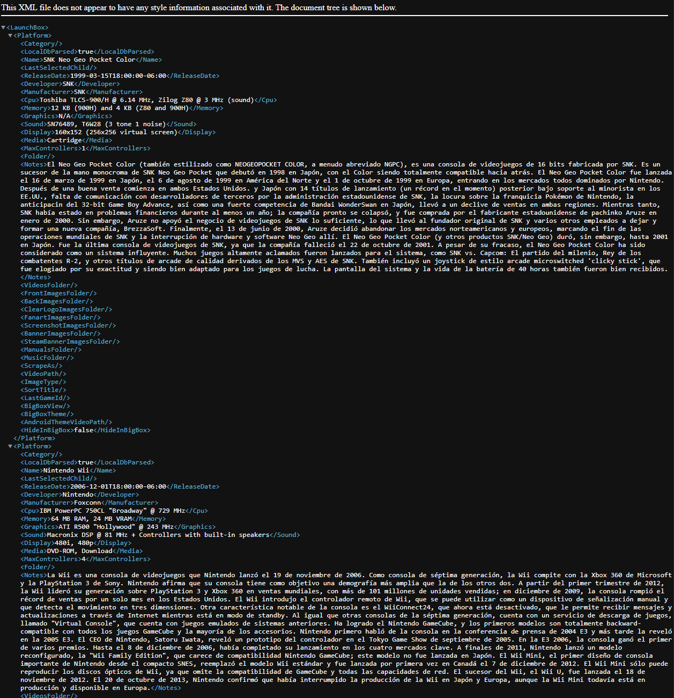
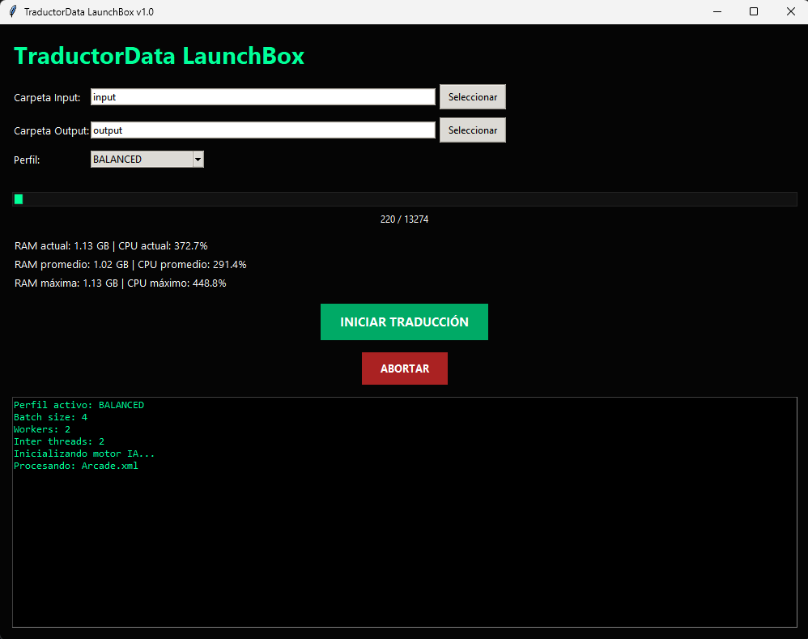

# 🎮 TraductorData LaunchBox
### Traducción MASIVA de metadata XML de LaunchBox usando IA Offline

<p align="center">
  
</p>


---

# 🚀 ¿Qué es esto?

Después de muchísimo tiempo buscando una solución REAL para traducir metadata de LaunchBox… terminé cansándome.

Probé plugins, scripts y herramientas externas, pero honestamente nunca logré encontrar algo estable, rápido y realmente funcional para bibliotecas grandes.

Así que terminé desarrollando mi propia herramienta.

## TraductorData LaunchBox

Una aplicación de escritorio que traduce automáticamente los nodos:

```xml
<Notes>
```

de los XML de LaunchBox utilizando IA local.

✅ Sin APIs  
✅ Sin servicios online  
✅ Sin límites  
✅ Todo corre directamente en tu PC  

---

# ⚡ Características

- Traducción masiva de XML
- IA completamente offline
- Compatible con grandes bibliotecas
- Cache SQLite inteligente
- Correcciones gamer automáticas
- Mantiene intacta la estructura XML
- Perfiles LOW / BALANCED / HIGH
- Optimizado específicamente para LaunchBox

---

# 🧠 Tecnologías utilizadas

- Python
- Transformers
- M2M100
- CTranslate2
- SQLite
- SentencePiece
- LXML
- LangDetect

---

# 🖼️ Ejemplo de resultado

## XML Original

<p align="center">
  
</p>


---

## XML Traducido

<p align="center">
  
</p>


---

# 📦 Instalación

## 1. Descargar Release

Ir a:

## Releases

y descargar:

```text
TraductorData_Launchbox_v1.00.zip
```

---

# ⚠️ IMPORTANTE

La primera vez que ejecutes la aplicación:

- descargará modelos IA automáticamente
- puede tardar varios minutos
- se recomienda ejecutar como administrador

---

# 📂 Cómo usarlo

## 1. Localizar XML de LaunchBox

Normalmente están en:

```text
LaunchBox\Data\Platforms
```

Ejemplos:

```text
Nintendo Entertainment System.xml
Super Nintendo Entertainment System.xml
Sega Genesis.xml
```

---

## 2. HACER BACKUP

⚠️ MUY IMPORTANTE

Haz una copia de seguridad de tus XML originales antes de reemplazarlos.

---

## 3. Copiar XML a INPUT

Copia los XML a:

```text
input
```

---

## 4. Ejecutar la aplicación

Abrir:

```text
TraductorData_LaunchBox.exe
```

Recomendado:

✅ Ejecutar como administrador

---

# 🖥️ Interfaz

<p align="center">
  
</p>


---

## 5. Elegir perfil

Disponibles:

- LOW
- BALANCED
- HIGH

Recomendación general:

✅ BALANCED

---

## 6. Iniciar traducción

Presionar:

```text
INICIAR TRADUCCIÓN
```

La aplicación:

- analiza XML
- detecta idioma
- traduce únicamente contenido necesario
- mantiene estructura original
- guarda automáticamente resultados

Durante el proceso de traducción puedes presionar el botón Abortar para detener el proceso actual.  
La próxima vez que inicies se mantendrá el avance de la traducción desde cache.  

---

## 7. Tomar XML traducidos

Los resultados aparecerán en:

```text
output
```

---

## 8. Reemplazar en LaunchBox

Copiar nuevamente los XML traducidos a:

```text
LaunchBox\Data\Platforms
```

y reemplazar los originales.

---

# 💾 Todo funciona OFFLINE

Una vez descargados los modelos:

✅ No necesita internet  
✅ No usa APIs  
✅ No manda datos a servidores  
✅ No tiene límites  

---

# 📁 Estructura del proyecto

```text
TraductorData_LaunchBox/
│
├── input/
├── output/
├── cache/
├── logs/
├── models/
│
├── main.py
├── settings.json
├── gamer_dictionary.json
└── build_portable.bat
```

---

# 📦 requirements.txt

```txt
transformers>=4.40.0
torch>=2.0.0
sentencepiece>=0.2.0
ctranslate2>=4.0.0
lxml>=5.0.0
langdetect>=1.0.9
psutil>=5.9.0
huggingface-hub>=0.20.0
protobuf>=4.25.0
sacremoses>=0.1.1
```

---

# ❤️ Proyecto hecho por necesidad real

Desarrollé esta herramienta porque literalmente no encontré nada que resolviera este problema de forma seria y automatizada para LaunchBox.

Espero que le sirva a más gente de la comunidad tanto como me sirvió a mí.

Si alguien la prueba, agradecería muchísimo feedback 🙌

---

# 📜 Licencia

MIT License
